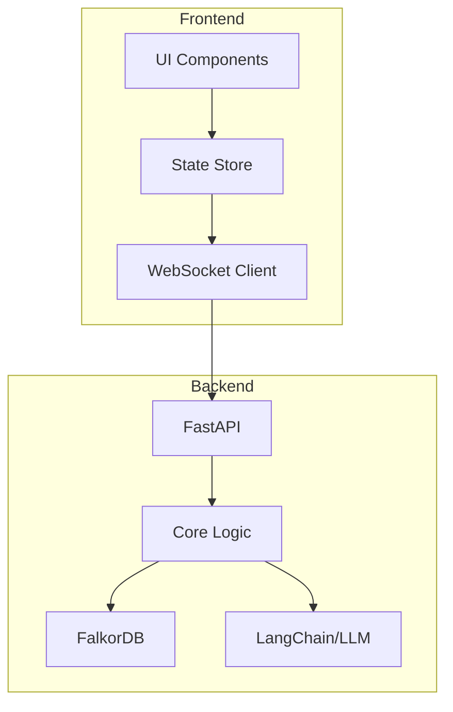

# branching-ai 아키텍처

## 모듈 구조

### 백엔드 (Python/FastAPI)
```
backend/
├── app/
│   ├── __init__.py
│   ├── main.py                 # FastAPI 앱 진입점
│   ├── config.py               # 환경 설정
│   │
│   ├── core/                   # 핵심 비즈니스 로직
│   │   ├── __init__.py
│   │   ├── branching/          # 분기 로직
│   │   │   ├── __init__.py
│   │   │   ├── detector.py    # 주제 감지
│   │   │   ├── manager.py     # 브랜치 관리
│   │   │   └── models.py      # 도메인 모델
│   │   │
│   │   ├── context/            # 컨텍스트 관리
│   │   │   ├── __init__.py
│   │   │   ├── summarizer.py  # 요약 생성
│   │   │   ├── manager.py     # 컨텍스트 관리
│   │   │   └── models.py
│   │   │
│   │   └── graph/              # 그래프 작업
│   │       ├── __init__.py
│   │       ├── operations.py  # CRUD 작업
│   │       ├── queries.py     # 그래프 쿼리
│   │       └── models.py
│   │
│   ├── api/                    # API 레이어
│   │   ├── __init__.py
│   │   ├── v1/
│   │   │   ├── __init__.py
│   │   │   ├── branches.py    # 브랜치 엔드포인트
│   │   │   ├── conversations.py # 대화 엔드포인트
│   │   │   ├── graphs.py      # 그래프 엔드포인트
│   │   │   └── websocket.py   # WebSocket 핸들러
│   │   └── deps.py            # 의존성 주입
│   │
│   ├── infrastructure/         # 외부 서비스 통합
│   │   ├── __init__.py
│   │   ├── database/
│   │   │   ├── __init__.py
│   │   │   ├── falkordb.py   # FalkorDB 클라이언트
│   │   │   └── connection.py  # 연결 관리
│   │   │
│   │   └── ai/
│   │       ├── __init__.py
│   │       ├── llm.py         # LLM 통합 (LangChain)
│   │       └── embeddings.py  # 임베딩 생성
│   │
│   └── schemas/                # Pydantic 스키마
│       ├── __init__.py
│       ├── branch.py
│       ├── conversation.py
│       └── graph.py
│
├── tests/
│   ├── unit/
│   ├── integration/
│   └── conftest.py
│
├── requirements.txt
├── requirements-dev.txt
└── Dockerfile
```

### 프론트엔드 (React/TypeScript)
```
frontend/
├── src/
│   ├── index.tsx               # React 앱 진입점
│   ├── App.tsx                 # 메인 앱 컴포넌트
│   │
│   ├── features/               # 기능별 모듈
│   │   ├── conversation/
│   │   │   ├── components/
│   │   │   │   ├── MessageList.tsx
│   │   │   │   └── MessageInput.tsx
│   │   │   ├── hooks/
│   │   │   │   └── useConversation.ts
│   │   │   └── services/
│   │   │       └── conversationApi.ts
│   │   │
│   │   ├── branching/
│   │   │   ├── components/
│   │   │   │   ├── BranchNode.tsx
│   │   │   │   └── BranchControls.tsx
│   │   │   ├── hooks/
│   │   │   │   └── useBranching.ts
│   │   │   └── services/
│   │   │       └── branchingApi.ts
│   │   │
│   │   └── graph/
│   │       ├── components/
│   │       │   ├── GraphCanvas.tsx
│   │       │   ├── NodeRenderer.tsx
│   │       │   └── EdgeRenderer.tsx
│   │       ├── hooks/
│   │       │   ├── useGraph.ts
│   │       │   └── useGraphInteraction.ts
│   │       └── services/
│   │           └── graphApi.ts
│   │
│   ├── shared/                 # 공통 모듈
│   │   ├── components/
│   │   │   ├── Layout/
│   │   │   └── UI/
│   │   ├── hooks/
│   │   │   ├── useWebSocket.ts
│   │   │   └── useAuth.ts
│   │   ├── services/
│   │   │   ├── api.ts         # API 클라이언트
│   │   │   └── websocket.ts   # WebSocket 클라이언트
│   │   └── utils/
│   │       └── helpers.ts
│   │
│   ├── store/                  # 상태 관리 (Zustand/Redux)
│   │   ├── index.ts
│   │   ├── conversationStore.ts
│   │   ├── branchStore.ts
│   │   └── graphStore.ts
│   │
│   └── types/                  # TypeScript 타입 정의
│       ├── conversation.ts
│       ├── branch.ts
│       └── graph.ts
│
├── public/
├── package.json
├── tsconfig.json
├── vite.config.ts              # Vite 설정 (CRA 대신)
└── Dockerfile
```

## 모듈 설계 원칙

### 1. 도메인 중심 설계 (DDD)
- **핵심 도메인**: branching, context, graph
- 각 도메인은 독립적인 모델과 비즈니스 로직 보유
- 도메인 간 느슨한 결합

### 2. 계층 분리
- **API 레이어**: HTTP/WebSocket 요청 처리
- **핵심 레이어**: 비즈니스 로직
- **인프라 레이어**: 외부 서비스 통합

### 3. 의존성 역전
- 핵심 로직은 인프라에 의존하지 않음
- 인터페이스를 통한 추상화

### 4. 기능별 모듈화 (프론트엔드)
- 각 기능(conversation, branching, graph)은 독립 모듈
- 컴포넌트, 훅, 서비스를 함께 배치

## 주요 모듈 간 상호작용



## 데이터 흐름

1. **대화 입력**
   - UI → WebSocket → API → Core/Branching
   
2. **분기 감지**
   - Core/Branching → LLM → 주제 분석 → 브랜치 생성
   
3. **그래프 업데이트**
   - Core/Graph → FalkorDB → WebSocket → UI 실시간 업데이트
   
4. **컨텍스트 관리**
   - Core/Context → 토큰 카운트 → 요약 생성 → DB 저장

## 개발 순서

1. **Phase 1: 기본 구조**
   - 백엔드 FastAPI 설정
   - 프론트엔드 React 설정
   - Docker 환경 구성

2. **Phase 2: 핵심 기능**
   - 대화 API
   - WebSocket 연결
   - 기본 UI

3. **Phase 3: 분기 로직**
   - LLM 통합
   - 분기 감지
   - 브랜치 생성

4. **Phase 4: 그래프 시각화**
   - FalkorDB 통합
   - 그래프 렌더링
   - 상호작용

5. **Phase 5: 고급 기능**
   - 컨텍스트 관리
   - 교차 연결
   - 내보내기